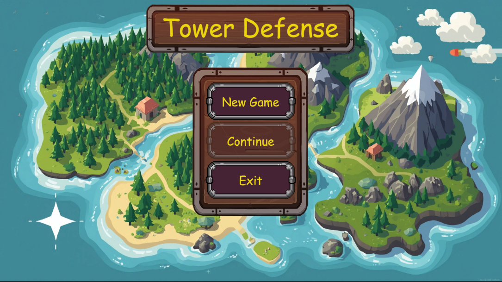
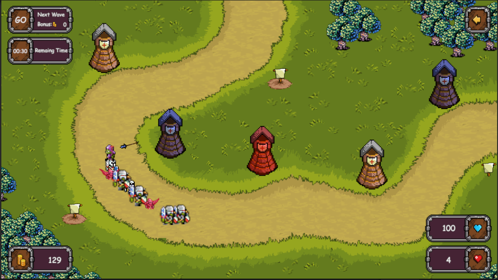
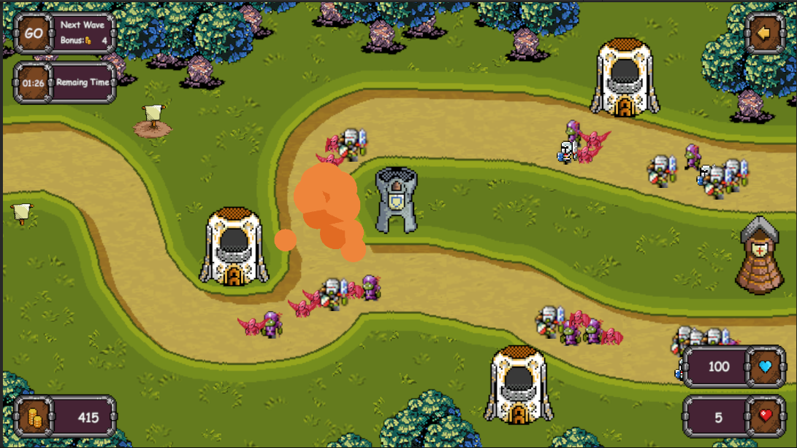
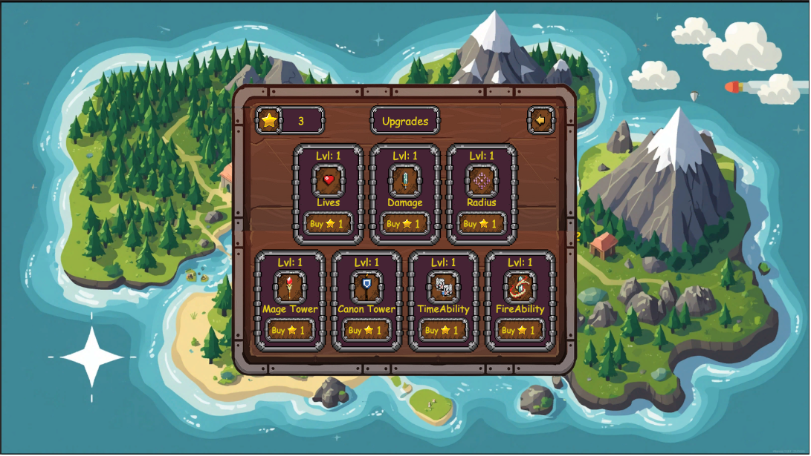
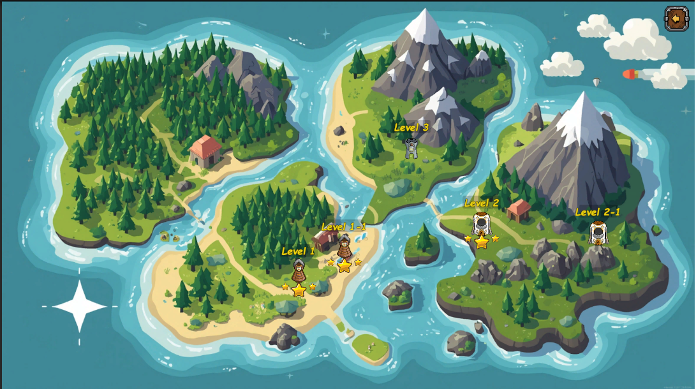

# Tower Defense Prototype

Прототип классической игры в жанре **Tower Defense**, созданный для отработки базовой логики стратегий, геймдизайна и систем прогрессии игрока.

## Скриншоты

<table>
  <tr>
    <td width="50%">
      
    </td>
    <td width="50%">
      
    </td>
  </tr>
</table>

## Механики

### Строительство и развитие башен
* **Ограничение позиций**: Строительство башен доступно только на специально заготовленных платформах.
* **Три типа башен**:
  *  **Обычная (Лучники)** — сбалансированная башня с быстрым темпом стрельбы.
  *  **Магическая** — наносит урон магическими сгустками.
  *  **Пушечная** — наносит высокий урон по площади.
* **Внутриигровая прокачка**: За золото, полученное за уничтожение врагов, можно улучшать башни прямо во время прохождения (повышаются урон и скорострельность).

### Прогрессия и Способности
* **Система звезд**: В зависимости от эффективности прохождения, уровень оценивается от 1 до 3 звезд.
* **Улучшения в главном меню**: Заработанные звезды можно потратить на постоянные усиления:
  * Увеличение запаса жизней базы.
  * Увеличение радиуса обнаружения врагов.
  * Базовое усиление мощи башен.
* **Активные способности (Мана)**: 
  *  **Замедление времени** для замедления скорости противников.
  *  **Точечный удар по площади** для уничтожения скоплений противников.

<table>
  <tr>
    <td width="50%">
      
    </td>
    <td width="50%">
      
    </td>
  </tr>
</table>

##  Управление
* **Левая кнопка мыши** — выбор и размещение башен, взаимодействие с интерфейсом (UI).
* **Панель способностей** — активация магии (требует ману).

##  Технологии
* **Движок**: Unity
* **Язык программирования**: C#
* **Графика**: 2D-спрайты
